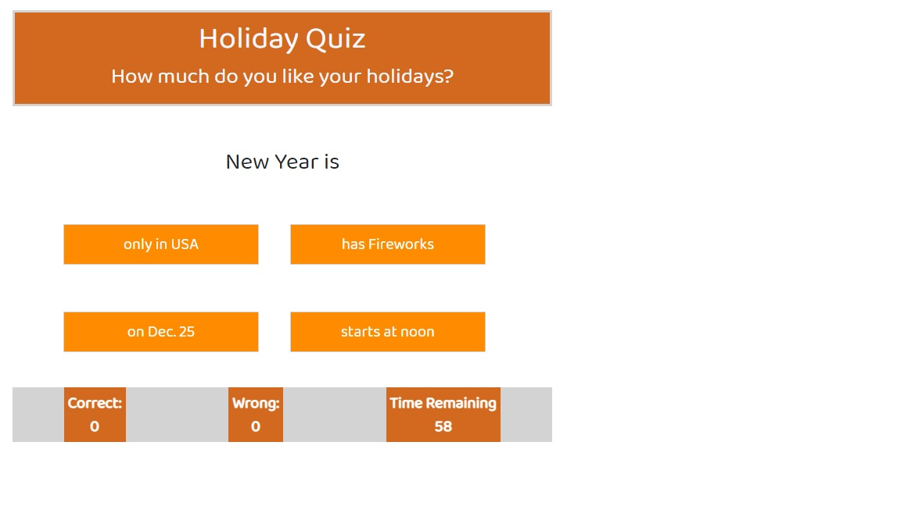

# quiz-holidays
This is a timed quiz game about the holidays.  Press START to clear the instructions and begin play.

You will be asked a random question about holidays.
For each question, you are given a choice of 4 answers. When the answer is correct it adds it to correct answers and gives you the next quetsion.  When the incorrect answer is selected, it adds it to your wrong score and takes 5 seconds off of the timer.

Answer as many correct as you can in 60 seconds.
When the game is over, it will clear the questions, letting you know the game is over leaving the score in the footer.

## Implementation
The application uses Javascript to minipulate the DOM and control the game play.
The quetsions use a randomizer to generate random questions.  If you play the game more than once, you should not receive the same question order.


The application is using Bootstrap for its responsiveness.  The buttons, color and spacing are coded in CSS/styles.css

## Site Picture




## Technologies Used
- HTML - use to make the game interface.
- CSS - styles were applied to ensure a fun, clean, responsive interface.
- JavaScript - Power the application using DOM manipulation and game functionality.
- Git - used for version control to track system changes.
- GitHub - used as the repository for Git version control
- Bootstrap - used for responsiveness

## Code Snippet


html
```

```

## Author Links
### Michael Downs
[LinkedIn](http://www.linkedin.com/in/michaeldownssj)  
[GitHub](https://chindowns.github.io/) 